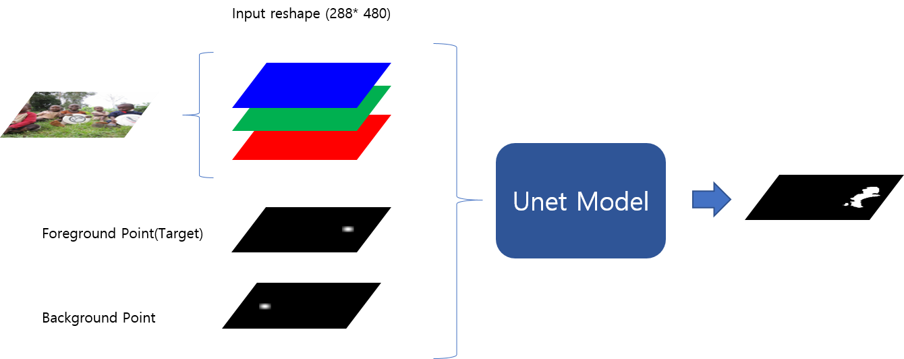

# UnetPointAnnotationSegmentation

# Model Result Kaggle: https://www.kaggle.com/parkwonro/pointannotation-and-segmentation-model-result

# Used Dataset
COCO: Common Objects in Context(COCO) 2017 Train/Val Dataset https://cocodataset.org/#home
DAVIS: A Benchmark Dataset and Evaluation Methodology for Video Object Segmentation (DAVIS) https://davischallenge.org/
============================================================================================

Two Point Interaction Model
Foreground Point(target) ,Background Point 
Point : Set of applying a Gaussian Filter(shape(21*21), segma:5)*k(255*/center_value) about random pixel in mask
